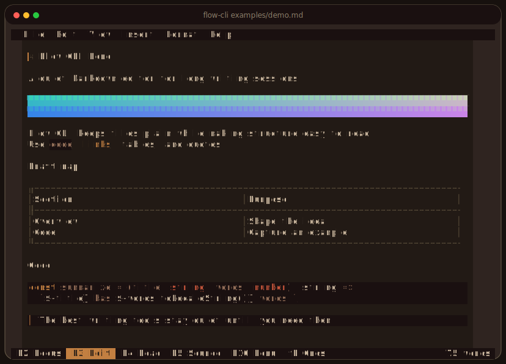

# Flow CLI

A keyboard-first Markdown editor that runs entirely in your terminal.

Flow CLI is built for writing, not just editing files. It keeps Markdown as the
source of truth while presenting headings, lists, blockquotes, code, tables,
links, and images as a quiet, readable document.



It is a real terminal editor rather than a browser view or a wrapper around
another editor: input handling, grapheme-aware layout, widgets, selection, and
incremental ANSI rendering are all implemented for the terminal.

## Highlights

- Edit, Focus, Read, and Source modes
- Markdown-aware formatting and syntax concealment
- Tables, links, images, math, code highlighting, and word counts
- Keyboard and mouse selection, menus, and scrolling
- Command palette, find and replace, clipboard integration, and configurable
  keybindings
- Atomic autosave, recovery snapshots, and external-change detection
- Built-in themes and configurable cursor behavior
- Native images in Kitty-compatible terminals and iTerm2, with a colored
  character-cell fallback elsewhere
- HTML and plain-text export

## Install

On macOS and Linux, install with Homebrew:

```bash
brew install saturn9studio/flow-cli/flow-cli
```

On Windows, install with WinGet:

```powershell
winget install --id Saturn9.FlowCLI --exact
```

Then open or create a Markdown document:

```bash
flow-cli document.md
```

Starting without a path creates an untitled draft in the current directory.
Documents are autosaved while you write.

## Essential shortcuts

| Shortcut | Action |
| --- | --- |
| `Ctrl+P` | Open the command palette |
| `Ctrl+F` / `Ctrl+H` | Find / replace |
| `F2` / `F3` / `F4` / `F5` | Focus / Edit / Read / Source |
| `F10` | Open the menu bar |
| `Ctrl+,` | Open settings |
| `Ctrl+C` / `Ctrl+X` / `Ctrl+V` | Copy / cut / paste |
| `Ctrl+Q` | Exit |

Command-modified clipboard shortcuts also work when the terminal forwards them.

## Terminal support

Flow CLI works without a terminal-specific graphics or keyboard protocol.
Compatible terminals automatically gain richer keyboard reporting and native
image rendering. Images still render as colored terminal cells when native
graphics are unavailable.

## Development

Run `npm run verify` to build the project and run the test suite.
